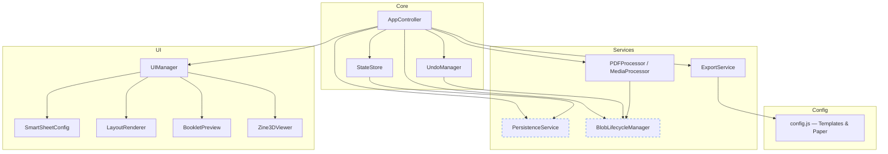

# Design Document: Zine-ify Improvements

## Overview

This design covers eight high-impact improvements to the Zine-ify progressive web application: session persistence (localStorage + IndexedDB), redo support in UndoManager, fixing the forced-landscape orientation bug, 90-degree page rotation, export quality controls (DPI and format), additional zine templates, accessibility improvements, and blob URL lifecycle management. These changes touch nearly every core module but are designed to be additive — existing APIs are extended rather than replaced — so that each improvement can be landed independently.

The guiding principles are: (1) keep the class-based vanilla JS architecture; (2) minimize breaking changes to existing event contracts; (3) each improvement must be independently shippable behind a feature boundary; (4) performance must not regress — especially memory usage around blob URLs.

## Architecture

The diagram below shows the current component topology (solid lines) and new/modified components introduced by this design (dashed lines).



### New Components

| Component | Responsibility |
|-----------|---------------|
| `PersistenceService` | Serializes/deserializes `StateStore` metadata to `localStorage` and page image blobs to IndexedDB. Handles versioned schema migrations. |
| `BlobLifecycleManager` | Centralized registry of all active blob URLs. Provides `acquire(blob) → url`, `release(url)`, and `releaseAll()`. Replaces ad-hoc `URL.createObjectURL` / `revokeObjectURL` calls. |

### Modified Components

| Component | Change Summary |
|-----------|---------------|
| `UndoManager` | Add redo stack, `redo()` method, and `canUndo`/`canRedo` getters. |
| `StateStore` | Replace `pageFlips: {}` with `pageRotations: {}` (0/90/180/270). Add `exportSettings`. Fix `updatePaperSettings` to respect `orientation` parameter. |
| `ExportService` | Accept DPI and format options from `state.exportSettings`. Render to PNG or JPEG at configurable DPI. |
| `AppController` | Wire persistence save/restore lifecycle, redo keybinding, rotation events, export settings. |
| `UIManager` | Keyboard navigation for page grid cells, ARIA live regions, rotation button, export settings panel. |
| `config.js` | Add `quarter-fold-4` and `half-fold-2` template definitions. |
| `PDFProcessor` / `MediaProcessor` | Route all blob creation through `BlobLifecycleManager`. |

## Components and Interfaces

### Component 1: PersistenceService

**Purpose**: Save and restore the user's work across browser sessions. Metadata (grid size, paper settings, rotations, export settings) goes to `localStorage`; binary page images go to IndexedDB to avoid the 5 MB localStorage cap.

**Interface**:
```javascript
interface PersistenceService {
  /** Save current state. Called on debounce after any state mutation. */
  save(state: StateStore): Promise<void>

  /** Restore state from storage. Returns null if nothing saved. */
  restore(): Promise<SavedSession | null>

  /** Delete all saved data. */
  clear(): Promise<void>

  /** Check if a previous session exists. */
  hasSavedSession(): boolean
}

interface SavedSession {
  version: number
  gridSize: { rows: number, cols: number }
  paperSize: string
  orientation: string
  margin: number
  exportSettings: ExportSettings
  pageRotations: Record<number, number>
  /** IndexedDB keys for page image blobs, indexed by slot */
  pageImageKeys: (string | null)[]
}
```

**Responsibilities**:
- Debounced autosave (500 ms after last state change)
- Schema versioning for forward compatibility
- Graceful degradation if IndexedDB is unavailable (skip binary save, warn user)
- On restore, rehydrate blob URLs via `BlobLifecycleManager.acquire()`

### Component 2: BlobLifecycleManager

**Purpose**: Centralized tracking of all blob URLs to prevent leaks. Every component that creates a blob URL must go through this manager.

**Interface**:
```javascript
interface BlobLifecycleManager {
  /** Create a blob URL and register it. Returns the URL. */
  acquire(blob: Blob): string

  /** Revoke a single blob URL and deregister it. No-op if not tracked. */
  release(url: string): void

  /** Revoke all tracked blob URLs. Used on clearAll or tab unload. */
  releaseAll(): void

  /** Number of currently active blob URLs (for debugging/testing). */
  readonly activeCount: number
}
```

**Responsibilities**:
- Maintain a `Set<string>` of all active blob URLs
- `release()` calls `URL.revokeObjectURL` and removes from set
- `releaseAll()` iterates the set, revoking each
- Registered as a `beforeunload` listener to clean up on tab close

### Component 3: UndoManager (Extended)

**Purpose**: Provide full undo/redo support using two stacks.

**Interface**:
```javascript
interface UndoManager {
  push(snapshot: Snapshot): void
  undo(): Snapshot | null
  redo(): Snapshot | null
  clear(): void
  readonly canUndo: boolean
  readonly canRedo: boolean
  readonly undoSize: number
  readonly redoSize: number
}

interface Snapshot {
  description: string
  allPageImages: (string | null)[]
  pageRotations: Record<number, number>
  pageZooms: Record<number, boolean>
  onPrune?: () => void
}
```

**Responsibilities**:
- On `push()`: push current state to undo stack, clear redo stack, prune oldest if over max
- On `undo()`: pop from undo stack, push current state to redo stack, return popped snapshot
- On `redo()`: pop from redo stack, push current state to undo stack, return popped snapshot
- On `clear()`: call `onPrune` for all entries in both stacks

### Component 4: StateStore (Extended)

**Purpose**: Centralized application state with corrected orientation handling and rotation support.

**Data Model Changes**:
```javascript
// BEFORE
{
  pageFlips: {},           // { index: boolean }
  orientation: 'landscape' // always forced
}

// AFTER
{
  pageRotations: {},       // { index: 0 | 90 | 180 | 270 }
  pageZooms: {},           // { index: boolean } — unchanged
  orientation: 'landscape' | 'portrait',  // actually respected
  exportSettings: {
    dpi: 300,              // 150 | 300 | 600
    format: 'jpeg',        // 'jpeg' | 'png'
    quality: 0.92          // 0.0–1.0, only used for jpeg
  }
}
```

**Orientation Bug Fix**:
```javascript
// BEFORE (broken)
updatePaperSettings({ paperSize, orientation }) {
  if (orientation) { this.orientation = 'landscape'; } // BUG: ignores value
}

// AFTER (fixed)
updatePaperSettings({ paperSize, orientation, customPaper }) {
  if (paperSize) { this.paperSize = paperSize; }
  if (orientation) { this.orientation = orientation; } // uses actual value
  if (customPaper) { this.customPaper = customPaper; }
}
```

### Component 5: ExportService (Extended)

**Purpose**: Export zine layouts to PDF with configurable quality.

**Interface Changes**:
```javascript
interface ExportSettings {
  dpi: 150 | 300 | 600
  format: 'jpeg' | 'png'
  quality: number // 0.0–1.0
}
```

**Key Changes**:
- `MM_TO_PX` computed dynamically: `state.exportSettings.dpi / 25.4`
- Canvas `toBlob` / `toDataURL` uses `state.exportSettings.format`
- For PNG: no quality parameter; for JPEG: uses `state.exportSettings.quality`
- `jsPDF.addImage` format string switches between `'JPEG'` and `'PNG'`
- Higher DPI means larger canvases — warn user for 600 DPI on low-memory devices

### Component 6: config.js — New Templates

**Purpose**: Add 4-page quarter-fold and 2-page half-fold templates.

```javascript
// New template: Quarter-fold (single sheet, one fold each way → 4 panels)
'quarter-fold-4': {
  label: '4-Page Quarter-Fold',
  pages: 4,
  grid: { rows: 2, cols: 2 },
  layout: [
    { page: 4, upsideDown: true },
    { page: 1, upsideDown: true },
    { page: 3, upsideDown: false },
    { page: 2, upsideDown: false }
  ],
  gridAreas: '"page4 page1" "page3 page2"',
  upsideDownPages: [1, 4],
  cutLines: null
}

// New template: Half-fold (single sheet folded in half → 2 panels)
'half-fold-2': {
  label: '2-Page Half-Fold',
  pages: 2,
  grid: { rows: 1, cols: 2 },
  layout: [
    { page: 2, upsideDown: false },
    { page: 1, upsideDown: false }
  ],
  gridAreas: '"page2 page1"',
  upsideDownPages: [],
  cutLines: null
}
```

### Component 7: UIManager — Accessibility

**Purpose**: Improve keyboard navigation, ARIA coverage, and screen reader announcements.

**Key Changes**:
- Page cells get `tabindex="0"`, `role="button"`, and `aria-label="Page N, [status]"`
- Arrow key navigation within the page grid (roving tabindex pattern)
- ARIA live region (`aria-live="polite"`) for status messages (replaces/augments `toast`)
- Rotation button added to page cell controls: cycles 0→90→180→270→0
- Focus management: after page add/remove, focus moves to the affected cell
- Skip-link for keyboard users to jump past the grid to controls

### Component 8: Blob URL Lifecycle Audit

**Current Issues Identified**:
1. `fillBlankSlots()` — calls `ensureBlankPageUrl()` which creates a blob URL once (cached), but on layout re-render the blank URL is assigned to multiple slots without tracking
2. `buildPreviewAsset()` — creates blob URLs stored in `previewAssetUrls[]` but `revokePreviewAssetUrls()` is only called in `handleView3d()` and `handleClearAll()`, not on every re-render
3. `UndoManager` snapshots hold blob URL strings — if the undo entry is pruned, `onPrune` revokes them, but if `clear()` is called the URLs in intermediate snapshots may not be revoked properly

**Fix Strategy**:
- All `URL.createObjectURL` calls routed through `BlobLifecycleManager.acquire()`
- All `URL.revokeObjectURL` calls routed through `BlobLifecycleManager.release()`
- `_blankPageUrl` is acquired once and never released until `clearAll`
- `previewAssetUrls` management moves into `BlobLifecycleManager` with a "preview" tag for batch release
- `UndoManager.clear()` iterates both stacks calling `onPrune`; verified in implementation

## Data Models

### StateStore Complete Schema (After Changes)

```javascript
interface StateStore {
  // Page data
  allPageImages: (string | null)[]   // blob URLs or null
  pageRotations: Record<number, 0 | 90 | 180 | 270>
  pageZooms: Record<number, boolean>
  
  // Grid & paper
  gridSize: { rows: number, cols: number }
  paperSize: 'a4' | 'a3' | 'letter' | 'legal' | 'a5' | 'custom'
  orientation: 'landscape' | 'portrait'
  margin: number  // mm
  customPaper?: { width: number, height: number }
  
  // Export
  exportSettings: {
    dpi: 150 | 300 | 600
    format: 'jpeg' | 'png'
    quality: number
  }
  
  // Workflow
  totalPages: number
  uploadedFiles: UploadedFile[]
  fileQueue: UploadedFile[]
  isProcessingQueue: boolean
  workflowPreviewed: boolean
  workflowExported: boolean
  
  // Internal
  _blankPageUrl: string | null
}
```

### UndoManager Snapshot Schema

```javascript
interface Snapshot {
  description: string
  allPageImages: (string | null)[]
  pageRotations: Record<number, 0 | 90 | 180 | 270>
  pageZooms: Record<number, boolean>
  onPrune?: () => void  // called when entry is evicted from stack
}
```

### PersistenceService IndexedDB Schema

```javascript
// Database: 'zine-ify-session', version 1
// Object Store: 'pageImages'
//   key: slot index (number)
//   value: Blob (raw image data)
//
// localStorage key: 'zine-ify-state'
// value: JSON-serialized SavedSession (without binary data)
```

### Template Definition Schema

```javascript
interface ZineTemplate {
  label: string
  pages: number
  grid: { rows: number, cols: number }
  layout: (number | { page: number, upsideDown: boolean })[]
  gridAreas?: string
  upsideDownPages?: number[]
  cutLines?: CutLineSpec | null
  sheets?: number
  description?: string
}
```

## Error Handling

### Error Scenario 1: IndexedDB Unavailable

**Condition**: Browser blocks IndexedDB (private browsing in some browsers, or storage quota exceeded)
**Response**: `PersistenceService.save()` catches the error, logs a warning, and disables autosave. Toast informs user: "Session save unavailable — work will not persist after refresh."
**Recovery**: App continues to function normally without persistence. User can still export.

### Error Scenario 2: Corrupted Saved Session

**Condition**: `PersistenceService.restore()` encounters invalid JSON or schema version mismatch
**Response**: Log warning, call `PersistenceService.clear()`, return `null` (fresh session)
**Recovery**: User starts with a clean slate. No crash.

### Error Scenario 3: High-DPI Export on Low-Memory Device

**Condition**: User selects 600 DPI, causing canvas dimensions to exceed device memory
**Response**: `ExportService.handleExport()` catches canvas allocation failure, falls back to 300 DPI, toasts a warning: "600 DPI not supported on this device — exported at 300 DPI."
**Recovery**: Export completes at reduced quality rather than failing entirely.

### Error Scenario 4: Redo After New Action

**Condition**: User performs undo, then makes a new edit (push to undo stack)
**Response**: Redo stack is cleared (standard behavior). Any blob URLs in pruned redo entries are released via `onPrune`.
**Recovery**: No memory leak. Redo becomes unavailable until next undo.

## Testing Strategy

### Unit Testing Approach

- Test `UndoManager` undo/redo with mock snapshots
- Test `StateStore.updatePaperSettings` actually stores orientation
- Test `BlobLifecycleManager` tracks and releases URLs
- Test `PersistenceService` serialization round-trip (mock IndexedDB with `fake-indexeddb`)
- Test `ExportService` DPI calculation produces correct canvas dimensions
- Test template definitions have valid layout arrays matching `rows * cols`

### Property-Based Testing Approach

Property-based tests using `fast-check` (recommended) for universal invariants. See Correctness Properties section below.

**Property Test Library**: fast-check

### Integration Testing Approach

- Playwright end-to-end tests verifying:
  - Upload → rotate → export cycle produces valid PDF
  - Session restore after page reload recovers page count
  - Keyboard-only navigation through page grid cells

## Performance Considerations

- **Blob URL budget**: `BlobLifecycleManager` should log a warning if `activeCount > 100` to catch leaks during development
- **IndexedDB writes are async**: autosave debounce of 500 ms prevents thrashing on rapid edits
- **600 DPI canvases**: For letter-size at 600 DPI the canvas is 5100×6600 pixels (~135 MB uncompressed). The design includes a fallback to 300 DPI if allocation fails.
- **Undo stack memory**: Each snapshot holds an array of blob URL strings (lightweight), not the actual image data. Blob data stays in browser memory until revoked.

## Security Considerations

- `PersistenceService` stores data locally only — no server communication
- IndexedDB data is origin-scoped and inaccessible to other domains
- PDF.js already disables scripting (`enableScripting: false`) — no change needed
- Export settings are validated (enum values only) to prevent injection into `jsPDF` calls

## Dependencies

| Dependency | Purpose | Status |
|-----------|---------|--------|
| `idb` (or raw IndexedDB API) | Simplified IndexedDB access for PersistenceService | New (optional — raw API is fine) |
| `fast-check` | Property-based testing library | New dev dependency |
| All existing deps | Unchanged | No upgrades required |

## Correctness Properties

*A property is a characteristic or behavior that should hold true across all valid executions of a system — essentially, a formal statement about what the system should do. Properties serve as the bridge between human-readable specifications and machine-verifiable correctness guarantees.*

### Property 1: Undo-Redo Round Trip

*For any* sequence of N push operations followed by K undo operations (K ≤ N), performing K redo operations SHALL restore the UndoManager to the same state as after the original N pushes.

**Validates: Requirements TBD**

### Property 2: Undo-Redo Stack Size Invariant

*For any* sequence of push, undo, and redo operations on an UndoManager with max capacity M, the sum `undoSize + redoSize` SHALL never exceed M.

**Validates: Requirements TBD**

### Property 3: Blob Lifecycle Acquire-Release Symmetry

*For any* sequence of `acquire` and `release` calls on `BlobLifecycleManager`, `activeCount` SHALL equal the number of `acquire` calls minus the number of successful `release` calls (where a release is successful if the URL was tracked).

**Validates: Requirements TBD**

### Property 4: Blob ReleaseAll Zeroes Count

*For any* set of N acquired blob URLs, calling `releaseAll()` SHALL result in `activeCount === 0`.

**Validates: Requirements TBD**

### Property 5: Persistence Round Trip

*For any* valid `StateStore` state (with serializable page data), `restore(save(state))` SHALL produce an equivalent state where all metadata fields match and all page image blobs are retrievable.

**Validates: Requirements TBD**

### Property 6: Rotation Cycle Idempotence

*For any* page rotation value R in {0, 90, 180, 270}, applying four successive 90° clockwise rotations SHALL return to the original rotation value (i.e., `(R + 4*90) mod 360 === R`).

**Validates: Requirements TBD**

### Property 7: Orientation Fidelity

*For any* valid orientation value V in {'landscape', 'portrait'}, after calling `updatePaperSettings({ orientation: V })`, reading `state.orientation` SHALL return V.

**Validates: Requirements TBD**

### Property 8: Export DPI Produces Correct Canvas Dimensions

*For any* paper size (width W mm, height H mm) and DPI setting D, the export canvas dimensions SHALL be `(Math.round(W * D / 25.4), Math.round(H * D / 25.4))`.

**Validates: Requirements TBD**

### Property 9: Template Layout Completeness

*For any* template definition T with `grid.rows * grid.cols = N`, the `layout` array SHALL have exactly N entries, and the set of page numbers referenced SHALL be exactly `{1, 2, ..., T.pages}`.

**Validates: Requirements TBD**

### Property 10: New Action Clears Redo Stack

*For any* UndoManager state where `redoSize > 0`, calling `push()` SHALL result in `redoSize === 0`, and all pruned redo entries SHALL have their `onPrune` callbacks invoked.

**Validates: Requirements TBD**
